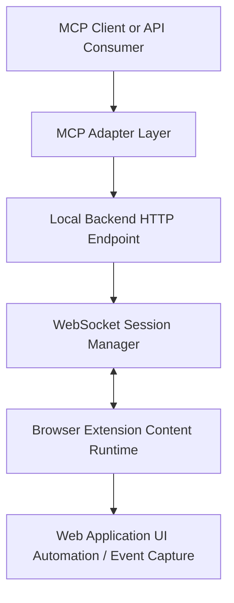
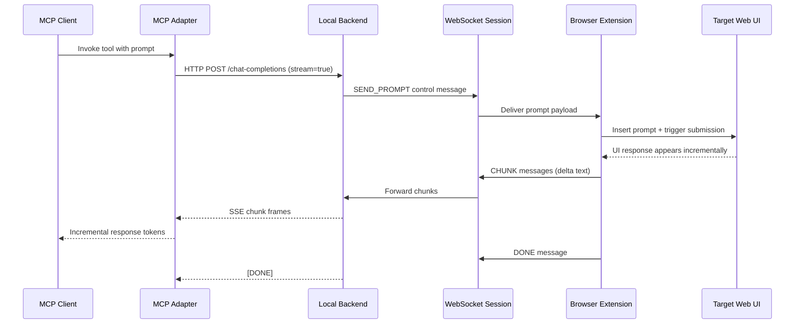

# WebSocket Connectivity Pattern for Browser Extension, Local Backend, and MCP Tooling

## Purpose

This document describes a generic connectivity architecture for enabling a browser extension to communicate with a local backend process, while exposing that capability through an MCP-compatible tool interface.

The goal is to provide a reusable technology pattern, independent of any single product, vendor, or implementation details.

## Architecture Overview

A common pattern is to separate responsibilities across three layers:

1. Browser Extension Layer
2. Local Backend Bridge Layer
3. MCP Adapter Layer

### Logical Topology



### Why This Split Works

- The browser extension handles UI-adjacent actions and streamed DOM/event observation.
- The backend centralizes session orchestration, concurrency control, and protocol translation.
- The MCP adapter remains simple and stateless, calling HTTP rather than managing browser sockets directly.

## Protocol Roles

### WebSocket: Backend <-> Extension

Use WebSocket for low-latency, bidirectional signaling between a local process and an extension runtime.

Typical message categories:

- Control messages from backend to extension (for example, "send prompt", "cancel", "ping")
- Data chunks from extension to backend (incremental output)
- Terminal state messages ("done", "error", "disconnected")

Benefits:

- Full duplex communication
- Minimal framing overhead for many small chunk events
- Natural fit for long-lived browser-runtime sessions

### HTTP + SSE: Backend <-> MCP Adapter / Clients

Use an HTTP endpoint for request ingress and stream responses as Server-Sent Events (SSE) to clients.

Typical behavior:

- Client posts one request payload
- Backend pushes incremental chunks as SSE data frames
- Stream ends with a terminal marker (for example, `[DONE]`)

Benefits:

- Compatible with existing OpenAI-style streaming client patterns
- Easy to consume from SDKs and CLI tools
- Keeps browser-specific transport concerns isolated in the backend

## End-to-End Request Flow



## Core Design Patterns

### 1. Single WebSocket Reader + Internal Queue

Avoid multiple coroutines/threads reading from the same WebSocket.

Recommended pattern:

- One dedicated receiver loop reads all incoming socket messages
- Receiver loop pushes parsed messages into an internal queue
- Worker/streaming logic consumes from the queue

This prevents competing-reader race conditions and simplifies state transitions.

### 2. Serialized In-Flight Requests

If one browser context can only process one interaction at a time, enforce a single active request.

Recommended controls:

- Use a lock/mutex around the full request lifecycle
- Reject concurrent requests with a clear busy status (for example, HTTP 429)
- Keep lock scope aligned with stream lifetime, not just initial dispatch

### 3. Queue Draining Between Sessions

Before starting a new request, clear stale messages from previous interactions.

This prevents cross-talk, such as old chunks appearing in a new stream.

### 4. Explicit Terminal Signals

Define terminal events as protocol primitives:

- `DONE`: normal completion
- `ERROR`: terminal failure
- `DISCONNECTED`: transport loss

Do not infer terminal state only from socket closure or missing DOM mutations.

### 5. Debounced Completion Detection in Extension

When extension output is derived from DOM updates, completion can be noisy.

Recommended technique:

- Detect content growth events
- Confirm completion only after a short debounce window with no new content and no active generation indicator
- Include a hard timeout as a final safety boundary

## Suggested Message Contract

Use a small, explicit JSON contract.

From backend to extension:

```json
{ "type": "SEND_PROMPT", "text": "..." }
```

From extension to backend:

```json
{ "type": "CHUNK", "text": "..." }
{ "type": "DONE" }
{ "type": "ERROR", "message": "..." }
```

Optional connection health:

```json
{ "type": "PING" }
{ "type": "PONG" }
```

Contract guidance:

- Keep message shapes stable and versionable
- Validate message types at boundaries
- Ignore unknown message types safely for forward compatibility

## Reliability Considerations

### Reconnection Strategy

Extension runtime should reconnect automatically when backend is unavailable.

Baseline approach:

- Retry every fixed interval (for example, 5 seconds)
- Avoid duplicate reconnect timers
- On reconnect, reset local capture state

### Timeout Strategy

Use layered timeouts:

- Backend request timeout (for client-facing SLA)
- Extension observer timeout (for UI capture safety)
- Optional heartbeat timeout (for dead socket detection)

### Error Mapping

Map backend states to client-readable outcomes.

Examples:

- No active browser connection -> service unavailable
- Existing in-flight request -> busy/retry later
- Transport drop mid-stream -> partial output + terminal event

## Security and Trust Boundaries

This pattern often runs locally, but still needs safeguards.

Recommended controls:

- Bind backend listener to loopback interface only
- Restrict extension host permissions to required origins
- Validate and sanitize incoming prompt payloads
- Avoid logging full sensitive payloads in production logs
- Consider CSRF/origin checks for local HTTP endpoints

If remote access is required in future, add authentication, TLS termination, and stricter authorization checks.

## Observability

Instrument each boundary with correlation identifiers.

Minimum telemetry points:

- Request accepted
- Prompt dispatched to extension
- First chunk latency
- Chunk count and byte count
- Completion reason (`DONE`, `ERROR`, `TIMEOUT`, `DISCONNECTED`)

Operational value:

- Faster root-cause analysis for dropped or empty responses
- Clear distinction between UI-layer delays and transport-layer delays
- Better capacity planning for serialized vs. parallel workloads

## MCP Integration Notes

Keep MCP integration intentionally thin.

Recommended responsibilities for MCP adapter:

- Accept tool input and normalize payload
- Call backend HTTP streaming endpoint
- Parse SSE chunk frames
- Return final concatenated response (or stream if client supports it)
- Convert transport errors into user-readable tool errors

Recommended responsibilities to avoid in MCP layer:

- No browser automation logic
- No WebSocket session state management
- No DOM-specific assumptions

This separation keeps the adapter portable across different MCP hosts.

## Scalability Paths

If you later need more throughput:

- Move from single-request lock to per-session locks (one lock per browser tab/session)
- Support multiple extension sessions with explicit session IDs
- Add a session router in backend for targeted prompt dispatch
- Introduce bounded queues and backpressure policies

## Failure Modes and Mitigations

1. Extension connected but target UI not ready
- Mitigation: readiness check before prompt submission; emit structured error.

2. Stream ends too early due to transient UI state
- Mitigation: debounce completion and require observed content before terminal state.

3. Stale chunks leaking into next request
- Mitigation: drain queue before each dispatch and use request correlation IDs.

4. Concurrent requests colliding in single UI context
- Mitigation: enforce serialization with explicit busy response.

5. Backend restart while extension remains loaded
- Mitigation: auto-reconnect loop in extension and idempotent connection handshake.

## Technology-Enabler Summary

This connectivity model enables browser-bound interactive systems to be consumed as programmable tools:

- WebSocket provides responsive, bidirectional control between backend and extension.
- HTTP+SSE provides broad client compatibility for streamed responses.
- MCP adapter exposes the capability as a composable tool without inheriting UI/runtime complexity.

The pattern is implementation-agnostic and can be reused anywhere a local browser runtime must be safely bridged into a tool-driven workflow.
